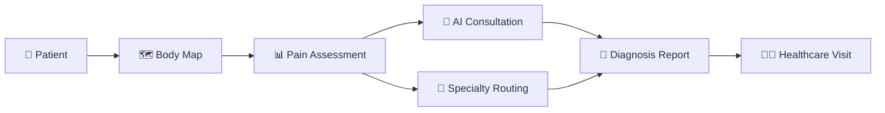

<div align="center">
  
  
  
  

  <br><br>


  <p>
    <strong>Intelligent Pain Assessment & Medical Specialty Routing</strong><br>
    <em>Your privacy-first clinical decision support companion</em>
  </p>

  <br>

  <a href="#-features">Features</a> •
  <a href="#-quick-start">Quick Start</a> •
  <a href="#-body-map">Body Map</a> •
  <a href="#-api-integration">API Integration</a> •
  <a href="#-build">Build</a> •
  <a href="#-tech-stack">Tech Stack</a>

  <br><br>
</div>

---

## 📋 Overview

**My Advocate** is a cross-platform Flutter application that transforms how patients describe and track pain. Through an interactive body map, comprehensive pain assessment tools, and AI-powered specialty routing, it bridges the gap between patient symptoms and appropriate medical care — all while keeping your data completely private.



---

## ✨ Features

<div align="center">
  <table>
    <tr>
      <td align="center" width="25%">
        <h3>🗺️</h3>
        <sub><strong>Body Mapping</strong></sub><br>
        <sup>48 tappable regions<br>Front & back views</sup>
      </td>
      <td align="center" width="25%">
        <h3>📊</h3>
        <sub><strong>Pain Assessment</strong></sub><br>
        <sup>7 categories<br>19 descriptors</sup>
      </td>
      <td align="center" width="25%">
        <h3>🧠</h3>
        <sub><strong>AI Consultation</strong></sub><br>
        <sup>Local LLM integration<br>20 specialty models</sup>
      </td>
      <td align="center" width="25%">
        <h3>🔒</h3>
        <sub><strong>Privacy First</strong></sub><br>
        <sup>100% local processing<br>No cloud uploads</sup>
      </td>
    </tr>
  </table>
</div>

### Interactive Body Mapping

| Feature | Description |
|---------|-------------|
| **Front & Back Views** | Toggle between anterior and posterior body views |
| **48 Tappable Regions** | Covers head, neck, shoulders, arms, torso, hips, legs, feet |
| **Pain Visualization** | Color-coded intensity: <span style="color:#4CAF50">● Mild</span> · <span style="color:#FFEB3B">● Moderate</span> · <span style="color:#FF9800">● Severe</span> · <span style="color:#F44336">● Very Severe</span> |
| **Specialty Mapping** | Each region links to relevant medical specialties |

### Detailed Pain Assessment

- **Intensity Slider** — 0–10 visual scale with color feedback
- **Pain Categories** — Nociceptive, Neuropathic, Nociplastic, Inflammatory, Acute, Chronic, Primary
- **19 Descriptors** — Aching, Burning, Sharp, Stabbing, Tingling, Throbbing, Shooting, and more
- **Timeline Tracking** — Date picker for pain onset
- **Trigger & Notes** — Free-text fields for onset description and additional details

### Medical Specialty Routing (20 Specialties)

The app uses a weighted scoring algorithm to recommend the most appropriate specialist:

```
Primary Care      Internal Medicine      Orthopedics      Rheumatology
Neurology         Pain Medicine          Gastroenterology  Cardiology
Urology           Gynecology             PM&R              Emergency Medicine
Dermatology       Oncology               Psychiatry        Endocrinology
Podiatry          Dentistry              Pulmonology       General Surgery
```

### AI-Powered Consultation

- **Configurable API Endpoint** — Defaults to `http://localhost:1234/v1` (LM Studio)
- **Per-Specialty Model Mapping** — Assign different LLM models to different specialties
- **Connection Testing** — Verify API connectivity with status indicators
- **OpenAI Compatible** — Works with any OpenAI-compatible local or remote API

### Diagnosis & Export

- **Summary View** — Complete pain profile with recommended specialties
- **AI Consultation** — Specialty-specific LLM response
- **Text Report Export** — Share via any platform share sheet
- **Medical Disclaimer** — Always displayed with every assessment

---

## 🚀 Quick Start

### Prerequisites

| Tool | Version | Link |
|------|---------|------|
| Flutter | 3.44+ | [flutter.dev](https://flutter.dev) |
| Dart | 3.12+ | Ships with Flutter |
| VS 2019+ | (Windows) | Visual Studio Build Tools |
| Android SDK | 34+ | [Android Studio](https://developer.android.com/studio) |

### Installation

```bash
# Clone the repository
git clone https://github.com/yourusername/my_advocate.git
cd my_advocate

# Install dependencies
flutter pub get

# Run on Windows
flutter run -d windows

# Run on Android
flutter run -d <device_id>

# Run on iOS (requires macOS)
flutter run -d ios
```

### Configuration

1. **Launch LM Studio** (or any OpenAI-compatible server)
2. **Load your model** in LM Studio
3. **Start the API server** (typically on port 1234)
4. **Open My Advocate** → Settings → Enter API endpoint
5. **Tap "Test Connection"** to verify
6. **Optional:** Assign models to specialties in Model Mapping

---

## 🗺️ Body Map

The interactive body map is the core interface. Here's how it works:

<pre style="background: #1a1a2e; color: #e0e0e0; padding: 16px; border-radius: 8px;">

  ┌─────────────────────────────────┐
  │         ● Front  ○ Back         │  ← Toggle view
  ├─────────────────────────────────┤
  │                                 │
  │     ┌──────┐                    │
  │     │ HEAD │                    │  ← Tap = pain entry
  │     │  ║   │                    │
  │     │ NECK │                    │
  │  ┌──┴──┐ ┌──┴──┐               │
  │  │SHDR │ │CHEST│ │SHDR         │
  │  │     │ │     │ │             │  ← Color = pain level
  │  │ ARM │ │ UPP │ │ ARM         │
  │  │     │ │ ABD │ │             │
  │  │     │ │ LOW │ │             │
  │  │     │ │ ABD │ │             │
  │  └──┬──┘ └──┬──┘ └──┬──┐      │
  │     │  ┌──┐ │  ┌──┐ │  │      │
  │     │  │HP│ │  │HP│ │  │      │
  │     │  └──┘ │  └──┘ │  │      │
  │     │  THIGH│  │THIGH│  │      │
  │     │  ┌──┐ │  ┌──┐ │  │      │
  │     │  │KN│ │  │KN│ │  │      │
  │     │  └──┘ │  └──┘ │  │      │
  │     │  CALF │  │CALF │  │      │
  │     │  ┌──┐ │  ┌──┐ │  │      │
  │     │  │FT│ │  │FT│ │  │      │
  │     │  └──┘ │  └──┘ │  │      │
  └─────────────────────────────────┘
</pre>

### Pain Intensity Colors

| Level | Label | Color | Hex |
|-------|-------|-------|-----|
| 0–2 | Mild | Green | `#4CAF50` |
| 3–4 | Moderate | Yellow | `#FFEB3B` |
| 5–7 | Severe | Orange | `#FF9800` |
| 8–10 | Very Severe | Red | `#F44336` |

---

## 🔌 API Integration

### LM Studio Setup

1. Download & install [LM Studio](https://lmstudio.ai/)
2. Browse and download a model (recommended: Mistral, Llama, Phi)
3. Go to the **Local Inference Server** tab
4. Select your model and click **Start Server**
5. Note the port (default: `1234`)

### API Configuration in App

```
Settings → API Configuration
─────────────────────────────────
Endpoint: http://localhost:1234/v1
Status:  ● Connected (tested)
─────────────────────────────────
Model Mapping:
  Primary Care:      mistral-7b-instruct
  Orthopedics:       medical-llama-13b
  Neurology:         medical-llama-13b
  Cardiology:        mistral-7b-instruct
  ... (customize per specialty)
```

### API Format

The app uses standard OpenAI-compatible chat completions:

```http
POST /v1/chat/completions
Content-Type: application/json

{
  "model": "your-model-name",
  "messages": [
    {"role": "system", "content": "You are a [specialty] specialist..."},
    {"role": "user", "content": "Patient reports pain in Left Shoulder..."}
  ],
  "temperature": 0.3,
  "max_tokens": 1024
}
```

---

## 🛠️ Build

### Windows (EXE)

```bash
# Debug build
flutter build windows --debug

# Release build
flutter build windows --release

# Output: build\windows\x64\runner\Release\my_advocate.exe
```

### Android (APK)

```bash
# Debug APK
flutter build apk --debug

# Release APK (requires signing)
flutter build apk --release

# Output: build\app\outputs\flutter-apk\app-release.apk
```

### iOS (IPA) — Requires macOS

```bash
# Build for iOS
flutter build ios --release

# Archive in Xcode → Export for App Store / Ad Hoc
```

---

## 📁 Project Structure

```
my_advocate/
├── lib/
│   ├── main.dart                    # App entry & theming
│   ├── models/
│   │   ├── body_region.dart         # Body region model & pain colors
│   │   ├── pain_assessment.dart     # Assessment data model
│   │   ├── medical_specialty.dart   # 20 specialties data
│   │   └── api_settings.dart        # API configuration model
│   ├── providers/
│   │   └── app_provider.dart        # Central state management
│   ├── screens/
│   │   ├── home_screen.dart         # Dashboard
│   │   ├── body_map_screen.dart     # Interactive body map
│   │   ├── diagnosis_screen.dart    # Full assessment & results
│   │   └── settings_screen.dart     # API & model config
│   ├── utils/
│   │   ├── region_data.dart         # 48 body regions data
│   │   ├── specialty_routing.dart   # Routing algorithm
│   │   └── api_service.dart         # API client
│   └── widgets/
│       ├── body_map_widget.dart     # Custom body painter
│       ├── region_detail_card.dart  # Region info card
│       └── pain_slider.dart         # Pain intensity slider
├── android/                         # Android configuration
├── ios/                             # iOS configuration
├── windows/                         # Windows configuration
└── pubspec.yaml                     # Dependencies
```

---

## 💻 Tech Stack

<div align="center">

| Technology | Purpose |
|------------|---------|
|  | Cross-platform UI framework |
|  | Programming language |
|  | State management |
|  | Local storage |
|  | API client |
|  | Report export |
|  | UI design system |

</div>

### Clinical Foundation

The pain assessment framework is based on established medical taxonomies:

- **ICD-11 Chronic Pain Classification** — [Vlaeyen et al., 2021](https://cris.maastrichtuniversity.nl/files/76244208/Vlaeyen_2021_Classification_algorithm_for_the_International.17_1_.pdf)
- **IASP Pain Taxonomy** — International Association for the Study of Pain
- **Anatomical Pain Referral Patterns** — Dermatome & visceral referral distributions
- **Medical Specialty Routing** — Based on standard referral guidelines across 20 specialties

---

## 🔒 Privacy

**My Advocate is designed with privacy as a core principle:**

| Aspect | Detail |
|--------|--------|
| **Data Processing** | 100% on-device — no cloud servers involved |
| **AI Inference** | Local via LM Studio — your data never leaves your machine |
| **Persistence** | Only API settings saved to SharedPreferences |
| **Session Data** | Pain assessments cleared between sessions |
| **Network** | Only connects to `localhost` for LLM inference |
| **Analytics** | None — zero telemetry |

---

## 📄 License

```
MIT License

Copyright (c) 2026 My Advocate

Permission is hereby granted, free of charge, to any person obtaining a copy
of this software and associated documentation files (the "Software"), to deal
in the Software without restriction, including without limitation the rights
to use, copy, modify, merge, publish, distribute, sublicense, and/or sell
copies of the Software, and to permit persons to whom the Software is
furnished to do so, subject to the following conditions:

The above copyright notice and this permission notice shall be included in all
copies or substantial portions of the Software.

THE SOFTWARE IS PROVIDED "AS IS", WITHOUT WARRANTY OF ANY KIND, EXPRESS OR
IMPLIED, INCLUDING BUT NOT LIMITED TO THE WARRANTIES OF MERCHANTABILITY,
FITNESS FOR A PARTICULAR PURPOSE AND NONINFRINGEMENT. IN NO EVENT SHALL THE
AUTHORS OR COPYRIGHT HOLDERS BE LIABLE FOR ANY CLAIM, DAMAGES OR OTHER
LIABILITY, WHETHER IN AN ACTION OF CONTRACT, TORT OR OTHERWISE, ARISING FROM,
OUT OF OR IN CONNECTION WITH THE SOFTWARE OR THE USE OR OTHER DEALINGS IN THE
SOFTWARE.
```

---

<div align="center">
  <sub>Built with ❤️ for better healthcare communication</sub>
  <br>
  <sub>⚠️ This application is for informational purposes only. Always consult a qualified healthcare professional.</sub>
</div>
